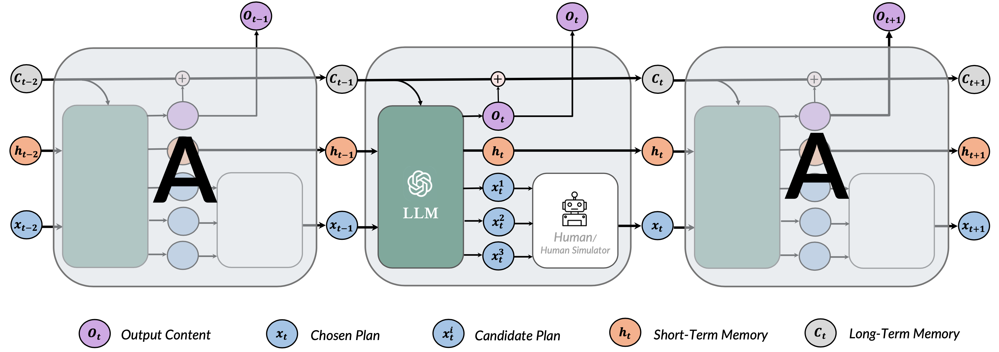
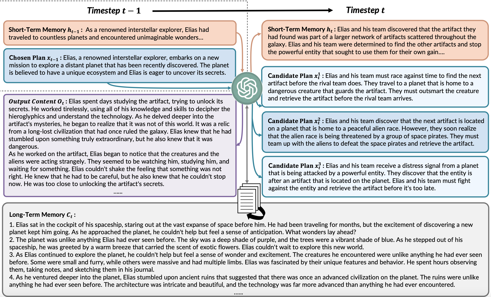
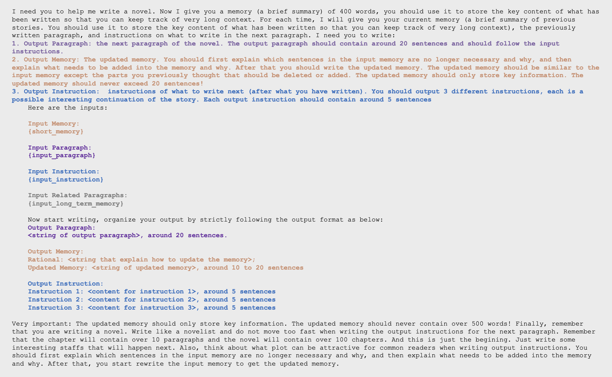
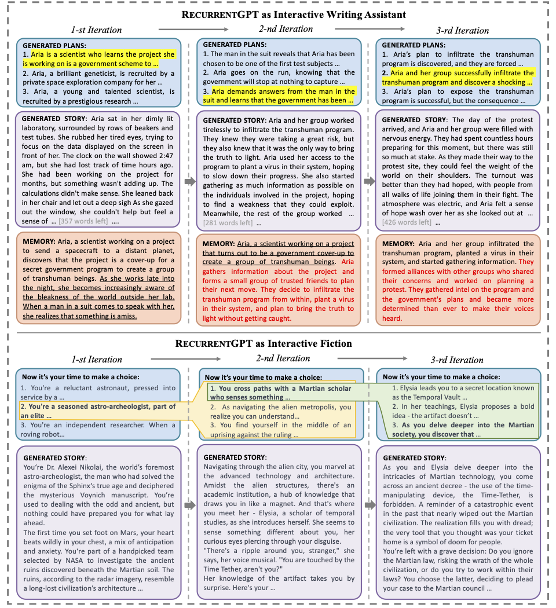
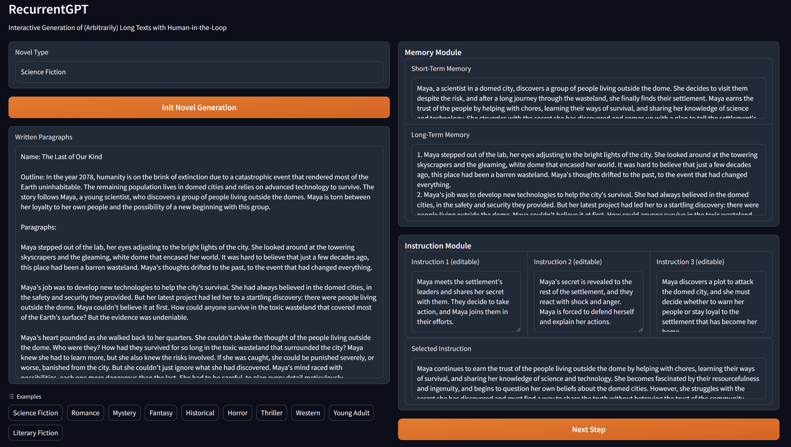

# RecurrentGPT

<p align="center"><a href="https://arxiv.org/pdf/2305.13304.pdf">[📄 Paper]</a> | <a href="https://www.aiwaves.org/recurrentgpt">[🤗 Demo - Writing Assistant]</a> | <a href="https://www.aiwaves.org/interactivefiction">[🤗 Demo - Interactive Fiction]</a> |  <a href="https://www.youtube.com/watch?v=rMnw3ljCibc">[📺 Video]</a> | <a href="https://discord.gg/aNznfrYPeR">[🔥 Discord]</a> </p>
<hr>

## Framework Illustration
<div align=center>

</div>

> RecurrentGPT replaces the vectorized elements (i.e., cell state, hidden state, input, and output) in a Long-short Term Memory RNN (LSTM) with natural language (i.e., paragraphs of texts), and simulates the recurrence mechanism with prompt engineering. 

> At each timestep t, RecurrentGPT receives a paragraph of text and a brief plan of the next paragraph, which are both generated in step t − 1. It then attends to the long-term memory, which contains the summaries of all previously generated paragraphs and can be stored on hard drives, and relevant paragraphs can be retrieved with semantic search.

> RecurrentGPT also maintains a short-term memory that summarizes key information within recent timesteps in natural language and is updated at each time step. RecurrentGPT combines all aforementioned inputs in a prompt and asks the backbone LLM to generate a new paragraph, a short plan for the next paragraph, and updates the long-short term memory by rewriting the short-term memory and appending the summary of the output paragraph to the long-term memory. 

### Example
<div align=center>

</div>


## Deployment
You can change the configurations given in the `recurrent.sh` script
```yaml
iteration: 10                       #(int) the number of rounds you would like it to roll.
outfile: response.txt               #(str) the output file path.
init_prompt: init_prompt.json       #(str) the path to the prompt used for initialization.
topic: Aliens                       #(str) the topic that you wish your novel is about.
type: science-fiction               #(str) the type of novel you would like to write.

```

Then after specify your `OPENAI_API_KEY` in the `recurrent.sh` file, you can run
```
sh recurrent.sh
```
NOTE: If your local internet is not allowed to access OpenAI's API, you might need to first export your HTTP proxy in the `recurrent.sh` file as well.
```
export http_proxy='your_proxy'
```

## Showcases

### Prompt Engineering
<div align=center>

</div>

### Iterations

<div align=center>

</div>

> Human writer starts by choosing the topic he/she wants to write and writes a short paragraph describing the background and the outline of the book. Then RECURRENTGPT automatically generates the first paragraphs and provides a few possible options for the writer to continue the story. The writer may select one from them and edit it if needed. He or she can also write a short plan for the next few paragraphs by him/herself if generated plans are all inappropriate, which makes human-AI co-writing process more flexible

## web demo
You can directly use our online demo at:
https://www.aiwaves.org/recurrentgpt  and https://www.aiwaves.org/interactivefiction

Or you can run it on your local machine by:
```
export OPENAI_API_KEY="your_api_key"
python gradio_server.py
```




## Citation
```angular2
@misc{zhou2023recurrentgpt,
      title={RecurrentGPT: Interactive Generation of (Arbitrarily) Long Text}, 
      author={Wangchunshu Zhou and Yuchen Eleanor Jiang and Peng Cui and Tiannan Wang and Zhenxin Xiao and Yifan Hou and Ryan Cotterell and Mrinmaya Sachan},
      year={2023},
      eprint={2305.13304},
      archivePrefix={arXiv},
      primaryClass={cs.CL}
}
```
